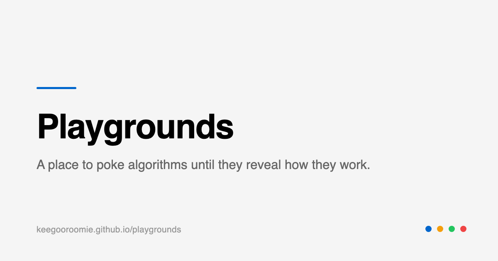

# Playgrounds

**A place to poke algorithms until they reveal how they work.**

Every entry pairs a plain-language write-up with a live simulation you can
actually touch. Drag a slider, reseed the noise, step a pathfinding algorithm
one move at a time and watch exactly why it made that choice.

No account, no install, nothing to run. Open a link and start turning knobs.

### 👉 [keegooroomie.github.io/playgrounds](https://keegooroomie.github.io/playgrounds/)

---

## Start here

New to this? Read them in this order — each one sets up the next.

| | Playground | What you'll learn | Try this first |
|---|---|---|---|
| 🌀 | **[Perlin Noise](https://keegooroomie.github.io/playgrounds/perlin-noise/)** | Why "smooth randomness" is a different thing from random static, and how one function ended up behind Minecraft terrain, clouds and organic motion | Push **octaves** from 1 to 5 and watch smooth hills grow rough. Then switch to the 3D view — it's the same numbers, drawn as a landscape |
| 🌿 | **[L-Systems](https://keegooroomie.github.io/playgrounds/l-system/)** | How a handful of rewrite rules — no geometry, no coordinates — expands into trees, ferns and coral | Change one symbol in the rule and re-run. Small edits to the rule cause enormous changes to the plant |
| 🐟 | **[Boids](https://keegooroomie.github.io/playgrounds/boids/)** | That a flock needs no leader: three rules applied locally by each agent produce coordinated group motion on their own | Move your cursor through the swarm to scatter it, then let go and watch the flock re-form without anyone organising it |
| 🔵 | **[BFS](https://keegooroomie.github.io/playgrounds/bfs/)** | Why a plain queue is enough to *guarantee* the shortest path — the data structure is the whole argument | Turn on step-by-step and watch the frontier expand in rings. Every cell in a ring is exactly the same distance from the start |
| 🔴 | **[DFS](https://keegooroomie.github.io/playgrounds/dfs/)** | What changes when you swap the queue for a stack: still finds a path, no longer the shortest one | Open it next to BFS on the same maze. Same start, same goal, very different route — that gap is what "guaranteed shortest" is worth |
| 🟡 | **[Dijkstra](https://keegooroomie.github.io/playgrounds/dijkstra/)** | How BFS generalises once steps stop costing the same, and why *cheapest* and *shortest* stop being the same thing | Paint a river of water across the direct route and re-run. It will happily walk a longer way around |
| 🌌 | **[Galaxy Sampler](https://keegooroomie.github.io/playgrounds/galaxy-sampler/)** | How to sample from a shape rather than uniformly — two power-law transforms turning flat randomness into spiral arms | Set **bunching** low, then high. You're reshaping the probability distribution itself, not moving any stars by hand |

## How to use these

- **Every page is a self-contained lesson.** Read the write-up, then the
  simulation underneath it is the same thing you just read about, live.
- **Step mode** on the pathfinding pages advances one move at a time, with a
  running count of operations, cells visited and path length. Slow it down until
  the choice each step makes is obvious.
- **Break things on purpose.** Push a parameter to its limit and figure out why
  the output falls apart — that's usually where the actual insight is.
- **Works on a phone**, and every link renders as a preview card when shared, so
  a single page is a fine thing to send someone.

## Why this exists

Most algorithm explanations are either a wall of prose or a video you watch
passively. Neither lets you ask "what if this number were bigger?" and get an
answer in the same second. Each page here started as a standalone experiment
built to answer exactly that question, and this is where they now live together.

## Inspiration

Two sites define the niche this is aiming at, and they set the bar:

- **[3Blue1Brown](https://www.3blue1brown.com/)** — visual intuition *before*
  formalism. The lesson taken from it: the animation isn't decoration attached
  to an explanation, it *is* the explanation.
- **[dynamicmath.xyz](https://dynamicmath.xyz)** — interactive widgets where you
  manipulate the object directly instead of watching it move.

The gap this tries to fill: both are mostly *watch and read*. Here every
parameter is live, and breaking the demo is the intended way to use it.

## Found a mistake?

Corrections to the explanations are as welcome as code. If something is wrong,
unclear, or glosses over the interesting part, that's a bug worth reporting —
[open an issue](https://github.com/KeeGooRoomiE/playgrounds/issues).

## Support

Everything here is free and stays free. If a playground taught you something
and you'd like the next one to exist, there's a **💛 Support** link in the site
footer, or:

- [GitHub Sponsors](https://github.com/sponsors/keegooroomie)
- **BTC** `bc1qpnfut422rr4w77y33h9gmc2jlcmllpdz0wp6nj`
- **ETH** `0xC99B66E5Cb46A05Ea997B0847a1ec50Df7fe8976`
- **TRX / USDT (TRC-20)** `TNdpADBLtAXE26L9W2j7qLmkzUwEt2nWvq`

## License

MIT for the code — see [LICENSE](LICENSE). The write-ups are the author's own
text.

Built with Astro, vanilla Canvas and no runtime framework. If you want to run
or extend it, everything is in [ARCHITECTURE.md](ARCHITECTURE.md) and
[docs/](docs/).
